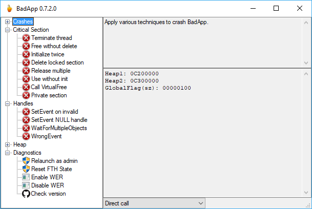

# BadApp

## Why BadApp?
When developing tooling to detect / fix bad application behavior, it can be hard to find applications exposing this bad behavior in a controlled way.

Combining all kinds of common application bugs in a simple application ensures that testing the detections or fixes is as simple as pressing a button.

## Features

* Heuristics:
    * Detect some known applied mitigations (SHIMS)
    * Detect the current 'ticket' state for the FTH
* Heap bugs:
    * Modify memory after it has been freed (Use after free)
    * Free memory twice (Double free)
    * Free allocation from another heap as it was allocated from
    * Write more data than was allocated (Buffer overflow)
* Crashes:
    * Crash by calling a nullptr
    * Crash by reading from a nullptr
    * Crash by writing to a nullptr
* Control the context the bugs will use:
    * Called from DialogProc
    * Called from a new thread
